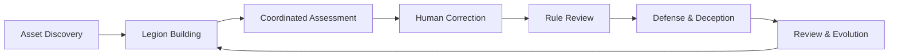
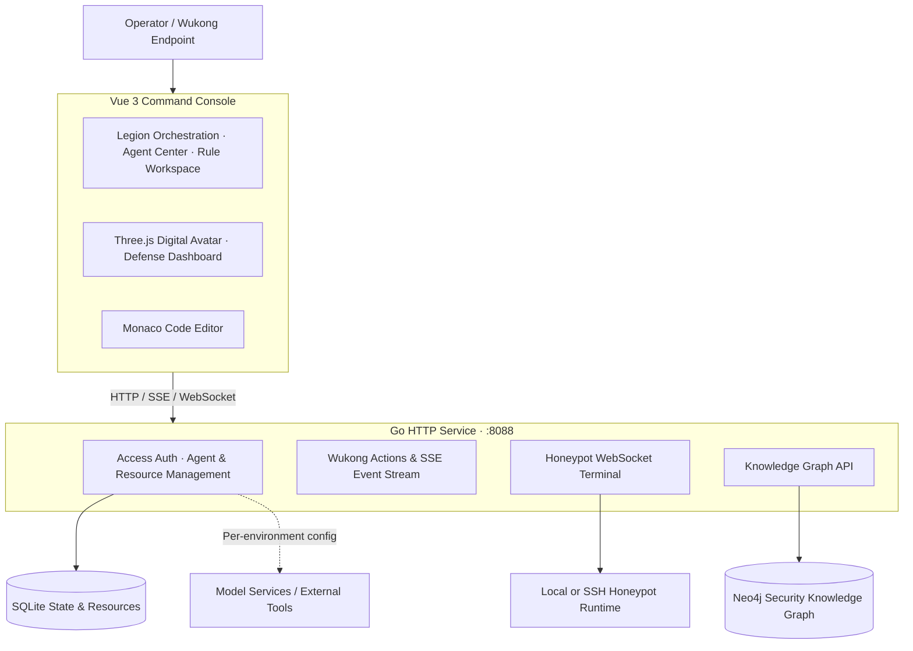

<div align="center">

# see-danger-everywhere

**Make threats visible. Make experts fight as one. Turn every response into reusable defense.**


A multi-agent collaborative active defense platform for enterprise security operations

**English** | [简体中文](README.zh-CN.md)

[Core Capabilities](#core-capabilities) · [Architecture](#architecture) · [Quick Start](#quick-start) · [Deployment](#deployment) · [Project Layout](#project-layout)

</div>

---

## One Commander, One Legion of Specialists, One Defense Loop

**Wukong commands, specialists assess, tools execute, humans make the critical calls.**

see-danger-everywhere brings asset discovery, specialist agents, tool resources, a security knowledge graph, and attack-defense response together on a single command console. With the embodied commander Wukong and its 3D digital avatar as the interaction hub, scattered security operations become an observable, interruptible, and reviewable workflow.

From the first alert, through legion takeover, evidence correlation, human-in-the-loop correction, and rule review, to honeypot deception and capability growth, the platform organizes operation and presentation around one complete security incident.



## Core Capabilities

| Capability | What it does on the platform |
| --- | --- |
| **Embodied Command · Wukong Commander** | 3D model with particle-assembly and online status; connects legion onboarding, action publishing, event streams, and attack-defense posture. |
| **Specialist Collaboration · Agent Center** | Manages specialist roles and configuration; organizes defense, forensics, attribution, and intelligence; visualizes legion response. |
| **Capability Assembly · Skills & MCP** | Manages tools and skill resources; supports Skill package upload, a code workspace, and AI editing APIs; the resource catalog ships 28 security skill directories and 27 MCP configurations. |
| **Knowledge Association · Security Knowledge Graph** | Neo4j graph queries, document ingestion, a Cypher console, relation calibration, and quality comparison — linking attack techniques, assets, evidence, and defense strategies. |
| **Human-Machine Teamwork · Assessment & Correction** | Inspect requests and responses around suspicious events, confirm attacks or dismiss false positives, and keep human judgment inside the response loop. |
| **Rule Loop · Defense Strategy Workspace** | Visualizes rule analysis, generation, validation, manual review, and deployment, with a built-in code editor and response artifacts. |
| **Active Deception · Honeypot Center** | WebSocket interactive terminal, honeypot reports, and screenshot/command-record uploads that concentrate deception evidence. |
| **Global Posture · Digital Defense Dashboard** | World attack map, asset and honeypot panorama, legion status, intrusion alerts, and defense-takeover animations. |

### From Traditional Web Attacks to Agent Security

The resource system covers SQL injection, webshells, command execution, ARP spoofing, DoH tunneling, and DGA domains, and extends into prompt injection, AI BOM, agent permission auditing, and A2A link tracing. A unified skill-package structure manages execution scripts, parameter constraints, output schemas, and result templates in one place.

> This repository currently provides the overall engineering structure and root-level configuration files. Directories such as `src/` and `server/` are structural placeholders; the full source code is maintained in an internal repository.

## Five-Phase Attack-Defense Workflow

| Phase | Theme | Key Operations |
| --- | --- | --- |
| **01 · See the battlefield** | Incident review & asset mapping | Onboard the commander, map network and AI assets, and establish scenario context. |
| **02 · Build the legion** | Specialist building & knowledge empowerment | Configure specialists, bind skills and tools, link knowledge bases, and calibrate the graph. |
| **03 · Head-on confrontation** | Attack detection & human correction | Watch attack events and legion response, inspect suspicious traffic, confirm attacks or veto false positives. |
| **04 · Update the defense line** | Rule generation & trusted execution | Review rule artifacts, validation results, and the approval workflow; complete policy deployment. |
| **05 · Grow stronger** | Second-round defense, deception & evolution | Visualize the updated defense, gather honeypot evidence, and review capability blind spots. |

See the [Phase Operations Guide (Chinese)](平台阶段操作流程说明.md) for detailed steps.

## Architecture



| Layer | Technology & Responsibilities |
| --- | --- |
| Frontend | Vue 3, Vue Router, Vite; Three.js for 3D scenes, Monaco for code editing, docx for report artifacts. |
| Backend | Go standard-library HTTP routing for access, resource management, legion events, and honeypot services. |
| Data | SQLite persists agents, resources, and runtime state; Neo4j stores and queries security knowledge relations. |
| Communication | HTTP API, Wukong SSE event stream, and honeypot WebSocket terminal. |
| Deployment | Go service on the host; Neo4j and Nginx via Docker Compose. |

## Quick Start

> **Repository note**: this public repository currently provides the engineering structure and root-level configuration files. Business directories such as `src/` and `server/` are structural placeholders; the full source code is maintained in an internal repository.

You need Node.js 20.19+ (20.x) or 22.12+, npm, and Go 1.25 or newer. The following commands use PowerShell as an example; the frontend and backend each occupy one terminal.

### 1. Get the project

```powershell
git clone https://github.com/Advinsu/see-danger-everywhere.git
cd see-danger-everywhere
```

### 2. Start the backend

```powershell
cd server
Copy-Item .env.example .env

# For a first look, use the mock graph — no Neo4j required.
$env:KNOWLEDGE_MODE = "mock"
$env:HONEYPOT_TERMINAL_ENABLED = "false"
go run ./cmd/api
```

The service listens on `http://localhost:8088` by default; the health check lives at `http://localhost:8088/healthz`. SQLite is enabled by default and initializes its data on first start.

If `.env` already exists, edit and keep the current configuration instead of copying again. To connect a real graph and the honeypot terminal, adjust `KNOWLEDGE_MODE`, the Neo4j connection parameters, and the honeypot execution settings.

### 3. Start the frontend

Open another terminal in the project root:

```powershell
npm ci
npm run dev
```

Open **http://localhost:5188**. The dev server proxies `/api` requests to `localhost:8088`.

The sample configuration ships an initial account `admin` with password `admin123`; change it via `A2A_ADMIN_USERNAME` and `A2A_ADMIN_PASSWORD` in `server/.env`.

### 4. Explore the workflow

After signing in, enter the phase pages, complete legion onboarding and specialist configuration, then move on to assessment, rule review, and post-incident review. The `/help` page documents access APIs, workflow triggers, and honeypot evidence upload.

| Page | Path |
| --- | --- |
| Asset discovery | `/discovery` |
| Five-phase workflow | `/phase/1` to `/phase/5` |
| Agent center | `/agents` |
| Digital defense dashboard | `/dashboard` |
| Honeypot center | `/honeypot` |
| Models / settings | `/models` / `/setting` |
| Access & operation help | `/help` |

## Deployment

The repository deploys with the **Go service on the host and Neo4j plus Nginx in containers**. Nginx in Compose serves the root `dist/` directory and forwards API requests to host port `8088`.

Prepare the frontend assets in the project root and start the base services:

```powershell
npm ci
npm run build
docker compose up -d
```

Then set `KNOWLEDGE_MODE=neo4j` in `server/.env`, make sure `NEO4J_PASSWORD` matches the password used by Compose, and start the Go service from `server/`. If you previously set `KNOWLEDGE_MODE=mock` in a terminal, remove it or switch it to `neo4j` — environment variables take precedence over `.env`.

| Service | Default entry |
| --- | --- |
| Nginx frontend | `http://localhost:5188` |
| Go backend | `http://localhost:8088` |
| Neo4j Browser | `http://localhost:7474` |
| Neo4j Bolt | `bolt://localhost:7687` |

The dev server and Nginx share the same frontend port; stop `npm run dev` before switching to deployment mode. `docker compose up -d` starts only Neo4j and Nginx — the Go service runs separately.

## Project Layout

```text
see-danger-everywhere/
├── src/                       # Vue command console, workflow pages, interactive components
│   ├── components/            # 3D Wukong, dashboard, graph, rules, honeypot
│   ├── features/              # Assessment artifacts, model config, platform settings
│   ├── views/                 # Page entries
│   └── router/                # Route definitions
├── public/                    # Public assets and robot models
├── server/
│   ├── cmd/api/               # Go service entry
│   ├── internal/httpapi/      # HTTP, SSE, and WebSocket APIs
│   ├── internal/service/      # Wukong, access, and honeypot services
│   ├── internal/knowledge/    # Neo4j and mock graph implementations
│   ├── internal/storage/      # SQLite and resource initialization
│   └── .env.example           # Environment configuration sample
├── skills/                    # Security skill definitions, scripts, and schemas
├── resource/                  # MCP configs, skill packages, knowledge materials
├── runtime/                   # Local evidence, captures, reports, and uploads
├── docker-compose.yml         # Neo4j + Nginx
└── nginx.conf                 # Static assets and API proxy
```

| Further reading | Content |
| --- | --- |
| [Phase Operations Guide](平台阶段操作流程说明.md) | Detailed operations and handoffs of the five phases (Chinese). |
| [Backend Guide](server/README.md) | Access service and knowledge graph APIs (shipped with source). |
| [Resource Delivery Guide](resource/README.md) | Skills, MCP, knowledge documents, and Cypher usage (shipped with source). |

---

<div align="center">

**See danger, everywhere.**

From seeing one attack to orchestrating a coordinated defense.

</div>
