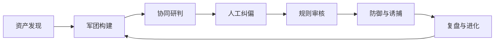
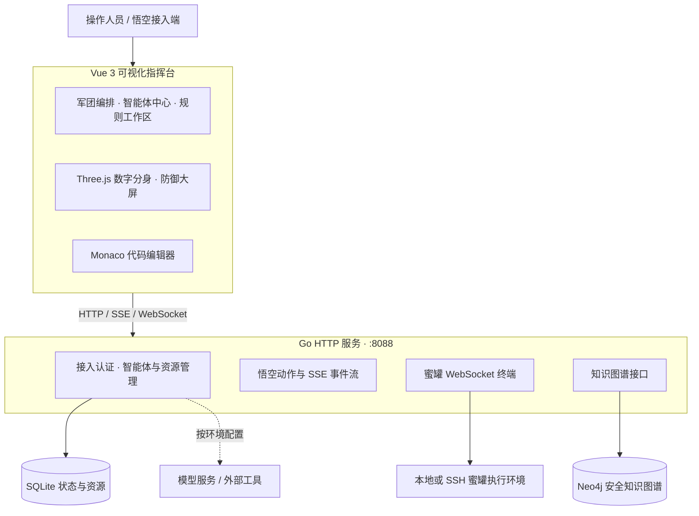

<div align="center">

# see-danger-everywhere

**让威胁被看见，让专家协同作战，让每一次处置沉淀为下一次防御能力。**


面向企业安全运营的多智能体协同主动防御平台

[English](README.md) | **简体中文**

[核心能力](#核心能力) · [系统架构](#系统架构) · [快速启动](#快速启动) · [部署方式](#部署方式) · [项目导航](#项目导航)

</div>

---

## 一位军团长，一支专家军团，一条防御闭环

**悟空负责指挥，专家负责研判，工具负责执行，人类掌握关键决策。**

see-danger-everywhere 将资产发现、专家智能体、工具资源、安全知识图谱与攻防处置汇聚到同一座指挥台。以悟空具身军团长及其 3D 数字分身为交互中心，把分散的安全动作串联成可观察、可干预、可复盘的协同流程。

从攻击告警亮起，到军团接管、证据关联、人工纠偏、规则审核，再到蜜罐诱捕与能力补全，平台围绕一次完整攻防事件组织操作与展示。



## 核心能力

| 能力 | 在平台中完成什么 |
| --- | --- |
| **具身指挥 · 悟空军团长** | 3D 模型、粒子聚合与在线状态展示，连接军团接入、动作发布、事件流和攻防态势。 |
| **专家协同 · 智能体中心** | 管理专家角色与配置，组织防御、取证、溯源、情报等专业分工，展示军团处置过程。 |
| **能力装配 · Skill 与 MCP** | 管理工具与技能资源，支持 Skill 包上传、代码工作区和 AI 编辑接口；资源目录包含 28 个安全 Skill 目录与 27 组 MCP 配置。 |
| **知识关联 · 安全知识图谱** | Neo4j 图谱查询、文档知识入库、Cypher 控制台、关系校准与质量对照，把攻击技术、资产、证据和防御策略关联起来。 |
| **人机协同 · 研判纠偏** | 围绕疑似事件查看请求响应、确认攻击或判定误报，并在处置流程中保留人工判断入口。 |
| **规则闭环 · 防御策略工作区** | 展示规则分析、生成、验证、人工审核与下发流程，配合代码编辑和处置产物管理。 |
| **主动诱捕 · 蜜罐中心** | WebSocket 交互终端、蜜罐报告、截图与命令记录上传，让诱捕过程和证据集中呈现。 |
| **全局态势 · 数字防御大屏** | 世界攻击态势、资产与蜜罐全景、军团状态、入侵告警和防御接管动画。 |

### 从传统 Web 攻击，延伸到智能体安全

资源体系覆盖 SQL 注入、Webshell、命令执行、ARP 欺骗、DoH 隧道、DGA 域名等场景，也纳入提示词注入、AI BOM、智能体权限审计与 A2A 链路追踪等方向。通过统一的技能包结构，将执行脚本、参数约束、输出 Schema 和结果模板集中管理。

> 本仓库当前提供工程整体结构与根目录配置文件；`src/`、`server/` 等业务目录为结构占位，完整源码在内部仓库维护。

## 五阶段攻防主线

| 阶段 | 主题 | 关键操作 |
| --- | --- | --- |
| **01 · 看清战场** | 事件复盘与资产测绘 | 接入军团长，梳理网络资产与 AI 资产，建立场景上下文。 |
| **02 · 组建军团** | 专家构建与知识赋能 | 配置专家、绑定技能与工具、关联知识库，完成图谱校准。 |
| **03 · 正面对抗** | 攻击发现与人工纠偏 | 观察攻击事件与军团响应，检查疑似流量，确认攻击或否决误报。 |
| **04 · 更新防线** | 规则生成与可信执行 | 查看规则产物、验证结果与审核流程，完成策略下发交互。 |
| **05 · 越战越强** | 二轮防御、诱捕与进化 | 展示更新后的防御过程，汇集蜜罐证据，复盘能力盲区。 |

详细操作见[平台阶段操作流程说明](平台阶段操作流程说明.md)。

## 系统架构



| 层次 | 技术与职责 |
| --- | --- |
| 前端 | Vue 3、Vue Router、Vite；Three.js 呈现三维场景，Monaco 提供代码编辑，docx 支持报告产物。 |
| 后端 | Go 标准库 HTTP 路由，承载接入、资源管理、军团事件与蜜罐服务。 |
| 数据 | SQLite 保存智能体、资源与运行状态；Neo4j 保存和查询安全知识关系。 |
| 通信 | HTTP API、悟空 SSE 事件流、蜜罐 WebSocket 终端。 |
| 部署 | 宿主机运行 Go 服务；Docker Compose 管理 Neo4j 与 Nginx。 |

## 快速启动

> **仓库说明**：本公开仓库当前提供工程整体结构与根目录配置文件；`src/`、`server/` 等业务目录为结构占位，完整源码在内部仓库维护。

准备 Node.js 20.19+（20.x）或 22.12+、npm，以及 Go 1.25 或更新版本。以下命令以 PowerShell 为例，前后端分别占用一个终端。

### 1. 获取项目

```powershell
git clone https://github.com/Advinsu/see-danger-everywhere.git
cd see-danger-everywhere
```

### 2. 启动后端

```powershell
cd server
Copy-Item .env.example .env

# 首次体验可使用 mock 图谱，无需先安装 Neo4j。
$env:KNOWLEDGE_MODE = "mock"
$env:HONEYPOT_TERMINAL_ENABLED = "false"
go run ./cmd/api
```

服务默认监听 `http://localhost:8088`，健康检查地址为 `http://localhost:8088/healthz`。SQLite 默认启用，首次启动会初始化数据。

已有 `.env` 时直接编辑并保留现有配置，无需重复复制。接入真实图谱和蜜罐终端时，分别调整 `KNOWLEDGE_MODE`、Neo4j 连接参数与蜜罐执行配置。

### 3. 启动前端

在项目根目录打开另一个终端：

```powershell
npm ci
npm run dev
```

打开 **http://localhost:5188**。开发服务器会将 `/api` 请求代理到 `localhost:8088`。

示例配置的初始登录账号为 `admin`，密码为 `admin123`；可通过 `server/.env` 中的 `A2A_ADMIN_USERNAME` 和 `A2A_ADMIN_PASSWORD` 修改。

### 4. 按主线体验

登录后进入阶段页面，完成军团接入与专家配置，再进入研判、规则审核和复盘流程。`/help` 页面提供接入接口、攻防流程触发方式及蜜罐证据上传说明。

| 页面 | 路径 |
| --- | --- |
| 资产发现 | `/discovery` |
| 五阶段攻防流程 | `/phase/1` 至 `/phase/5` |
| 智能体中心 | `/agents` |
| 数字防御大屏 | `/dashboard` |
| 蜜罐中心 | `/honeypot` |
| 模型管理 / 平台设置 | `/models` / `/setting` |
| 接入与操作帮助 | `/help` |

## 部署方式

仓库采用 **Go 服务运行于宿主机，Neo4j 与 Nginx 运行于容器** 的部署方式。Compose 中的 Nginx 读取根目录 `dist/`，并将 API 请求转发到宿主机 `8088` 端口。

在项目根目录准备前端产物并启动基础服务：

```powershell
npm ci
npm run build
docker compose up -d
```

随后在 `server/.env` 中设置 `KNOWLEDGE_MODE=neo4j`，使 `NEO4J_PASSWORD` 与 Compose 使用的密码一致，再从 `server/` 启动 Go 服务。如果此前在终端设置过 `KNOWLEDGE_MODE=mock`，也需移除或改为 `neo4j`，因为环境变量优先于 `.env`。

| 服务 | 默认入口 |
| --- | --- |
| Nginx 前端 | `http://localhost:5188` |
| Go 后端 | `http://localhost:8088` |
| Neo4j Browser | `http://localhost:7474` |
| Neo4j Bolt | `bolt://localhost:7687` |

开发服务器与 Nginx 默认使用同一个前端端口，切换部署模式前需停止 `npm run dev`。`docker compose up -d` 仅启动 Neo4j 和 Nginx，Go 服务需单独运行。

## 项目导航

```text
see-danger-everywhere/
├── src/                       # Vue 指挥台、攻防流程页面与交互组件
│   ├── components/            # 3D 悟空、大屏、图谱、规则、蜜罐
│   ├── features/              # 研判产物、模型配置与平台设置
│   ├── views/                 # 页面入口
│   └── router/                # 路由定义
├── public/                    # 公共图片与机器人模型
├── server/
│   ├── cmd/api/               # Go 服务入口
│   ├── internal/httpapi/      # HTTP、SSE 与 WebSocket 接口
│   ├── internal/service/      # 悟空、接入与蜜罐业务
│   ├── internal/knowledge/    # Neo4j 与 mock 图谱实现
│   ├── internal/storage/      # SQLite 与资源初始化
│   └── .env.example           # 环境配置样例
├── skills/                    # 安全技能定义、脚本与 Schema
├── resource/                  # MCP 配置、技能交付包与知识材料
├── runtime/                   # 本地证据、抓包、报告与上传目录
├── docker-compose.yml         # Neo4j + Nginx
└── nginx.conf                 # 静态资源与 API 代理
```

| 继续阅读 | 内容 |
| --- | --- |
| [阶段操作说明](平台阶段操作流程说明.md) | 五阶段流程的具体操作与衔接。 |
| [后端说明](server/README.md) | 接入服务与知识图谱接口（随源码发布）。 |
| [资源交付说明](resource/README.md) | Skill、MCP、知识文档与 Cypher 使用方式（随源码发布）。 |

---

<div align="center">

**看见危险，无处不在。**

从看见一次攻击，到组织一场协同防御。

</div>
